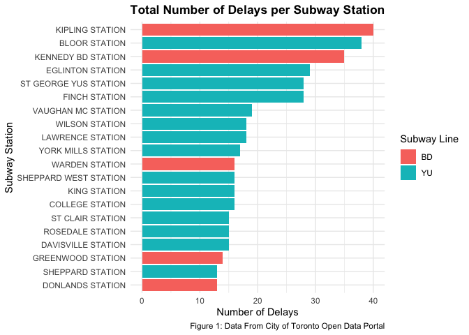
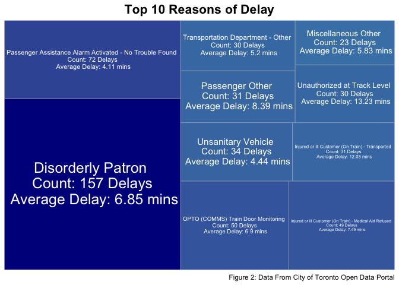
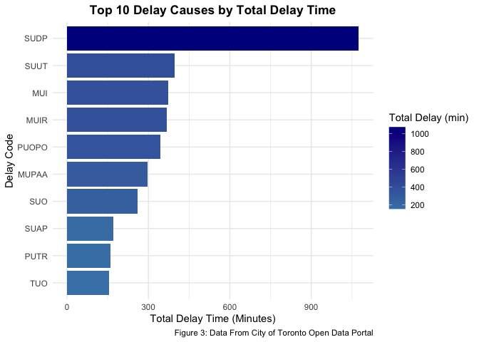
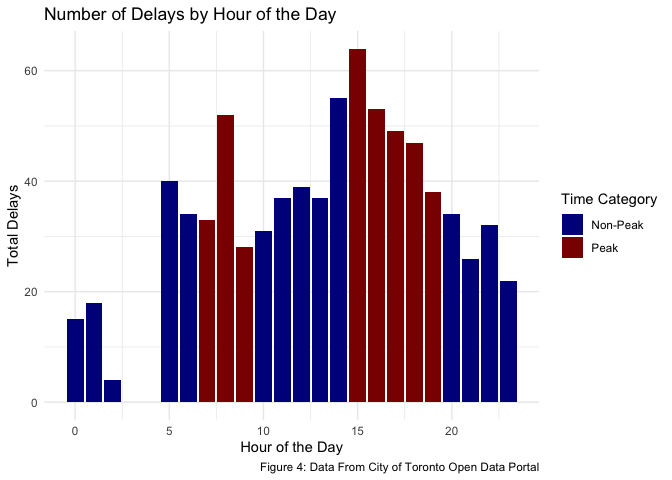

Toronto Subway Delay Analysis: Causes, Timing, and Line-Specific
Patterns
================
Avi Walia
March 14, 2025

[GitHub Repository:
Avi04w/TTC-Subway-Delays](https://github.com/Avi04w/TTC-Subway-Delays)

# Introduction

The Toronto Transit Commission (TTC) subway system is a critical part of
Toronto’s public transportation network, servicing over a million riders
daily across multiple lines. However, subway delays have been a
persistent issue, impacting the efficiency and reliability of the
service. Understanding the primary causes of these delays and how they
vary by time of day and across different subway lines is essential for
improving service quality and enhancing passenger experience.

This study aims to investigate the following questions:

1.  What are the primary causes of subway delays in Toronto?
2.  How do these delays vary by subway line/station?

**Hypothesis:**

- **Hypothesis 1:** Mechanical issues are the most common causes of
  subway delays in Toronto.
- **Hypothesis 2:** Delays are more frequent during peak hours (7-9 AM
  and 3-7 PM) compared to non-peak hours.
- **Hypothesis 3:** The Yonge-University line experiences more frequent
  delays than other lines due to higher passenger volumes and longer
  track lengths. Bloor-Yonge and Union stations will have the most and
  longest delays on this line since they are the most crowded stations
  in terms of ridership.

To address these questions and test the hypotheses, we will utilize the
TTC Subway Delay Data provided by the City of Toronto’s Open Data
portal. The dataset contains detailed information on delay incidents for
the year 2024, including:

- **Delay Codes** and their descriptions indicating the reasons for
  delays.
- **Time Stamp Information** such as date, time, and day of the week.
- **Location Details** including the station and subway line affected.
- **Duration of Delays** measured in minutes.

The data was acquired using the City’s Open Data API. By exploring and
analyzing this dataset, we seek to identify patterns and trends in delay
causes, assess peak times for delays, and determine if specific lines
and/or stations are more prone to certain types of delays. This analysis
will inform potential strategies for mitigating delays and improving the
TTC’s operational efficiency.

# Methods

### Data Acquisition

The dataset used in this analysis was obtained from the City of Toronto
Open Data Portal using the Open Data API. The data includes all recorded
subway delays in Toronto for th year 2024, along with the delay codes,
time, location, and other metadata. Additionally, a delay code
definitions dataset was obtained from the same API and this was merged
with the original data to provide description of each delay type.

The extracted data includes:

- **Time Stamp Information** (Date, Time, Day of Week, Hour of Delay)
- **Location Details** (Station, Subway Line, Direction of Train)
- **Delay Duration** (Minutes Delayed)
- **Delay Cause** (Codes and Descriptions)
- **Subway Car Details** (Vehicle ID)

### Data Cleaning and Wrangling

Several process steps were applied to clean and prepare the data for
analysis.

1.  **Filtering Out Non-Delays and Multi-Station Delays**
    - Some records had a delay of 0 minutes (or None). We are not
      interested in these incidents as they do not actually effect
      commute times for riders. This removed many of the columns with
      missing values.
    - Some delays were TTC wide or spanned multiple stations. We did not
      include these as there is no way to pinpoint the cause of these
      delays. This was done using REGEX to remove values that included
      “TO”, “TOWARD”, or “-”.
2.  **Handling Missing Values:**
    - The rest of the columns with missing information were removed.
3.  **Column Type Formatting:**
    - The Minutes Delayed was a char column, this was converted to int
    - The Time column was originally formatted as **HH:MM** and was
      converted to hms.
    - The Date column was converted from a character to Datetime.
    - An extra categorical column was added, distinguishing between peak
      and non-peak times.
4.  **Merging Delay Codes Information**
    - The delay codes were matched with their corresponding descriptions
      from the delay code definitions dataset.
5.  **Erroneous Data and Outliers**
    - There is some data that was incorrectly inputted. One such example
      is that Warden station is once listed as being on the
      Yonge-University Line when it is actually on the Bloor-Danforth
      Line.
    - There is a delay that lasted 6 hours that started at 4am. This is
      a massive outlier that occurred when the trains were not even
      running. We can ignore this point as it is not indicative of any
      trends that we are trying to find.

There are 788 observations and 14 variables for each observation.

### Exploratory Data Analysis (EDA)

To understand the nature of the subway delays, the following initial
analyses were performed:

- **Summary Statistics:**
  - Calculated the total number of delays and average delay duration at
    each station.
  - Identified the most common delay causes and their frequency.
- **Visualizations:**
  - **Treemap:** Delay reasons visualized in proportional blocks.
  - **Bar Chart:** Number of delays per subway line and station.
- **Time-Based Analysis:**
  - Created peak (7-9 AM, 3-7 PM) vs non-peak delay summaries.
  - Examined how delay frequencies change by the hour.

# Prelimary Results

We can first look at the total delays and average delay duration by
station:

| Station               | Total Delays | Average Delay Time |
|:----------------------|-------------:|-------------------:|
| KIPLING STATION       |           40 |           5.925000 |
| BLOOR STATION         |           38 |           4.815790 |
| KENNEDY BD STATION    |           35 |           4.485714 |
| EGLINTON STATION      |           29 |           6.551724 |
| FINCH STATION         |           28 |           6.250000 |
| ST GEORGE YUS STATION |           28 |           5.571429 |
| VAUGHAN MC STATION    |           19 |           4.473684 |
| LAWRENCE STATION      |           18 |          12.833333 |
| WILSON STATION        |           18 |           7.500000 |
| WARDEN STATION        |           17 |           7.705882 |

Top 10 Stations with Most Delays

<!-- -->

From this, we can see that Kipling, Bloor, Kennedy, Eglinton, Finch, St
George, and VMC stations have the highest number of delays. These are
all either transfer stations or are terminal stations (with the
exception of Eglinton which is one of the busiest stations and the site
of a future transfer station). We can also see that more
Yonge-University line stations have have a large amount of delays,
Kipling and Kennedy, which are are on the BD line have the most and
third most delays. No stations from the Sheppard line made this list. We
can further look into this by exploring the types of delays that are
occurring at stations.

| Code Description | Count | Average Delay Time |
|:---|---:|---:|
| Disorderly Patron | 157 | 6.847134 |
| Passenger Assistance Alarm Activated - No Trouble Found | 72 | 4.111111 |
| OPTO (COMMS) Train Door Monitoring | 50 | 6.900000 |
| Injured or ill Customer (On Train) - Medical Aid Refused | 49 | 7.489796 |
| Unsanitary Vehicle | 34 | 4.441177 |
| Injured or ill Customer (On Train) - Transported | 31 | 12.032258 |
| Passenger Other | 31 | 8.387097 |
| Transportation Department - Other | 30 | 5.200000 |
| Unauthorized at Track Level | 30 | 13.233333 |
| Miscellaneous Other | 23 | 5.826087 |

Top 10 Most Frequent Delay Causes

<!-- -->

The top reasons for subway delays in Toronto seem to be
passenger-related incidents, with “Disorderly Patron” being the most
frequent cause, accounting for 157 delays with an average delay of 6.85
minutes. Other notable causes include Passenger Assistance Alarm
Activation (72 delays, 4.11 min avg) and OPTO (COMMS) Train Door
Monitoring (50 delays, 6.9 min avg).

We can also look at which delays took the most time total:

<!-- -->

| Code  | Code Description                                         |
|:------|:---------------------------------------------------------|
| SUDP  | Disorderly Patron                                        |
| SUUT  | Unauthorized at Track Level                              |
| MUI   | Injured or ill Customer (On Train) - Transported         |
| MUIR  | Injured or ill Customer (On Train) - Medical Aid Refused |
| PUOPO | OPTO (COMMS) Train Door Monitoring                       |
| MUPAA | Passenger Assistance Alarm Activated - No Trouble Found  |
| SUO   | Passenger Other                                          |
| SUAP  | Assault / Patron Involved                                |
| PUTR  | Rail Related Problem                                     |
| TUO   | Transportation Department - Other                        |

Delay Code Definitions

The top delay causes by total delay time highlight disorderly patrons as
the most significant issue, causing over 1,000 minutes of delays
throughout the year. Other major contributors include unauthorized
people at track level, and injured or ill customers, each accumulating
several hundred minutes of delays. Passenger-related incidents,
including assaults, alarms, and other disruptions, collectively
contribute to substantial downtime. The difference we see with this and
the last visualization is that a few of the most commonly occurring
delays, such as the passenger alarm being activated and unsanitary
vehicle are not in the top 10 of total delay time since the average time
for those delays is much less.

Finally, we can view the occurrence of delays distributed by the time of
day at which they occur.

| Time Category | Total Delays | Average Delay Time | Average Number of Delays |
|:--------------|-------------:|-------------------:|-------------------------:|
| Non-Peak      |          424 |               7.36 |                 30.28571 |
| Peak          |          364 |               7.37 |                 45.50000 |

Delays During Peak vs Non-Peak Hours

<!-- -->

There is no data for 3 and 4 am as the subway is closed for those hours.
There is a major peak in the number of delays during the afternoon
(between 2 and 4 pm), with the highest delays occurring around 3pm. What
is interesting is that while the number of delays is much higher during
peak hours, the average time of each delay is almost the same.

# Summary

This analysis of TTC subway delays has provided several key insights
into delay causes, timing patterns, and station-specific trends. The
most frequent delay and the delay that has wasted the most amount of
time this year is **Disorderly Patrons**, accounting for 157 recorded
delays and taking a total of 1075.45 hours, much more than any other
delay type. Other common delay types include passenger assistance alarms
being activated, train door monitoring issues, and medical emergencies.
However, when examining total delay time, disruptions such as
unauthorized people at track level and injured or ill customer incidents
accumulate significantly more system downtime, despite occurring less
frequently.

in terms of time-based patters, delays are more frequent during peak
hours (7-9 AM, 3-7 PM) when the TTC is running more trains, with a
noticeable spike at 3 PM. Interestingly, while peak hours have more
delays, the average duration of each delay is similar to non-peak
periods, suggestions that the nature of delays remains relatively
consistent through the day. Additionally, certain stations such as
Kipling, Bloor, Kennedy and Finch experience the highest number of
delays, many of which are near major transfer or terminal stations.

### Next Steps and Modeling Plan

To build upon these findings, the final project will focus on:

1.  **Predictive Analysis:**
    - Use time series analysis (e.g. ARIMA, Prophet) to forecast future
      subway delays based on historical trends.
    - Explore seasonal patterns in subway delays; e.g., *do mechanical
      issues spike in winter?*
    - Investigate correlations between delays and external factors such
      as weather conditions, day of the week, or special events.
      Additional data sets can be found to do this.
2.  **Statistical and Machine Learning Models:**
    - Conduct regression analysis to understand how factors like station
      type, peak hours, and delay cause influence delay duration.
3.  **Operational Optimization Strategies:**
    - Provide data-driven recommendations for reducing subway delays,
      particularly at high-impact stations and peak hours.
    - Identify whether increasing security presence at key stations
      could help reduce delays from disorderly pators and other
      passenger-related incidents.
4.  **Network Analysis:**
    - Examining how delays propagate across the subway system and
      whether incidents on one line impact others.
